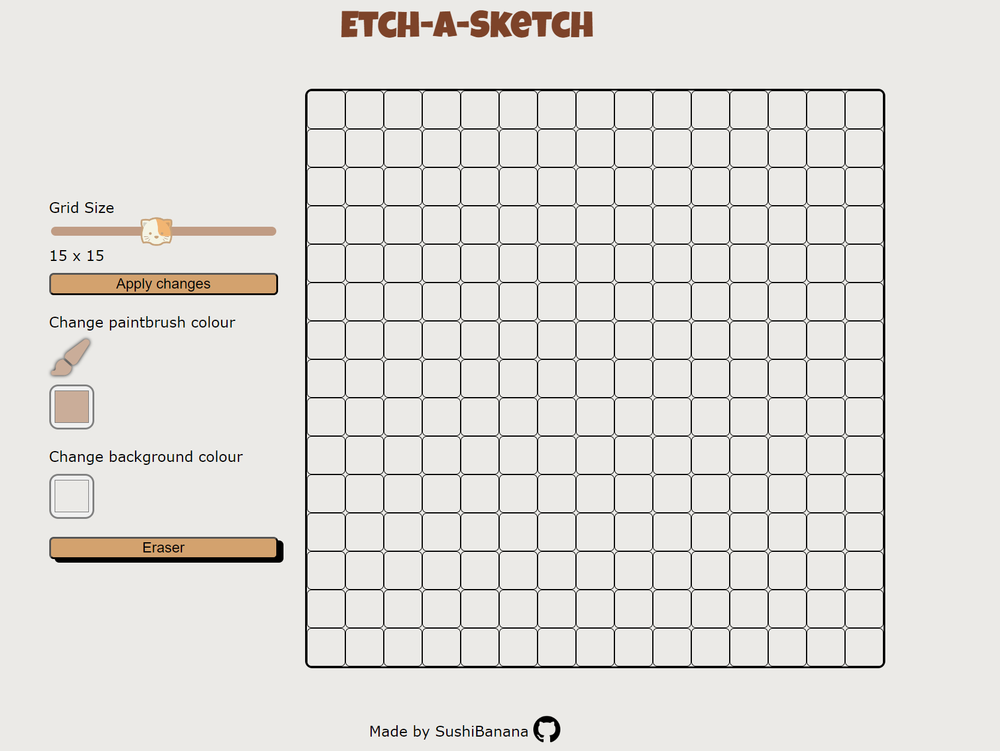

# Etch-a-Sketch

Theres a steep learning curve when attempting this project which the Odin Project doesn't touch on (which is completely normal btw! Learning is best done without spoon-feeding)
If you're from the Odin Project and are wondering where to start here's a few things I wish I knew:

1. You'll have to create 2 functions to append the squares to the grid. The functions are called `createGrid` and `createDiv`.

2. The `gridContainer` is well, a container for all the items (in this case the tiny squares). Getting gridContainer.clientWidth / number of squares per row allows u to determine the width and height of the tiny squares. The `createGrid` function has two for loops, one nested in the other. The outer for loop is to create the row, the inner is to create the column.

3. In the `createDiv` function, make sure to assign the squares to a class with `square.classList.add` for changing the color or design.

4. Creating the grid container was a bit of a hassle, sometimes all the squares would fit into the `gridContainer` perfectly on my laptop and then when I tried it on the monitor it would overflow. I noticed changing the height and width of my gridContainer from vw to rem solved this problem.

5. Make sure to revise on bubbling, propogation and capturing which was previously mentioned on Odin's website as this knowledge was needed for this project.

6. Read up on `target` and `curerntTarget`. Here's a [video](https://www.youtube.com/watch?v=SpatM1W5wRQ) comparing the two. I found that this helped clear my confusion.

7. Append the event listener to the `gridContainer` instead of each individual square.